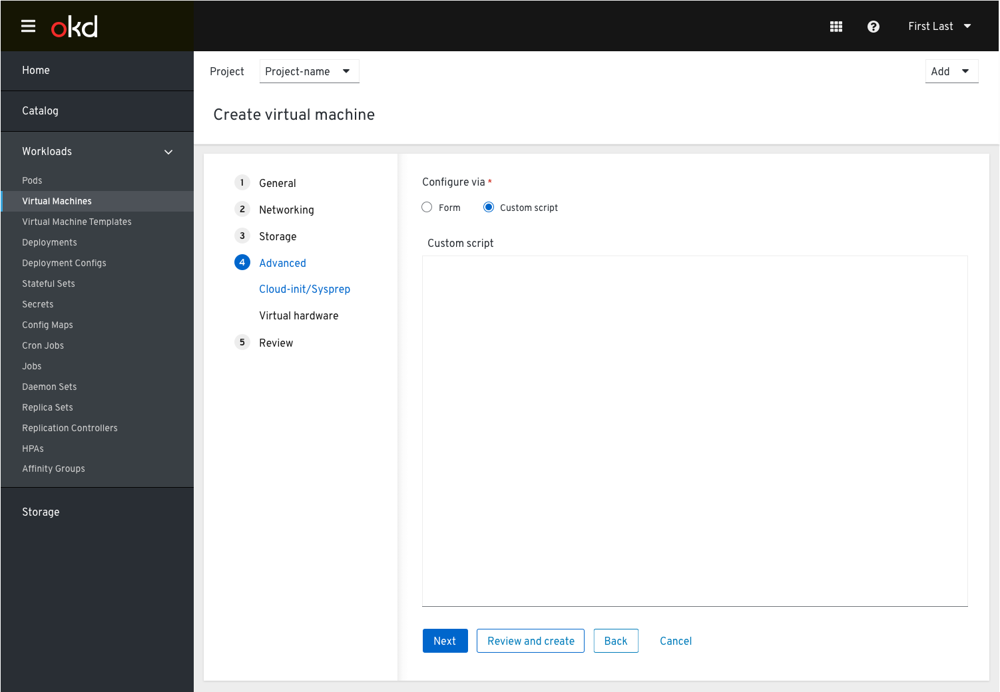

# Create VM Step 4: Advanced

The “Advanced” setting step of the create VM wizard includes:

- Cloud-Init / Sysprep - determines the contents of these settings based on the OS that is selected. (The difference between the cloud-init and the sys-prep is basically the difference between windows and other OSs)
- Virtual hardware

### Cloud-Init / Sysprep

The user has 2 options (radio buttons to choose from) to configure the "cloud-init/Sysprep" settings:

1. by filling a form (default)
2. by writing a custom script

- SSH Authorized Keys: Enter a comma-separated list of public SSH keys that can be used for authentication.
- NIC: Select the NIC that should communicate with the DNS servers.
- DNS Servers: Enter a comma-separated list of DNS server IP addresses.
- DNS Search Domains: Enter a comma-separated list of DNS search domain IP addresses.

By the default the user fills out the fields in the form

In case the user chooses to use a custom script

### Virtual hardware

Windows guest agent installer is located in this section and it needs to include information about the drivers to improve virtual machine performance, enable resource monitoring, and provides graceful power control options.

